# RetroMCP Architecture Documentation

## Overview

RetroMCP implements **Hexagonal Architecture** (Ports and Adapters) with comprehensive security hardening and Test-Driven Development (TDD) methodology. The system enables AI assistants to safely manage RetroPie systems through the Model Context Protocol (MCP).

## System Overview Diagram

```mermaid
graph TB
    %% External Layer
    Claude[Claude Desktop/AI Assistant] --> MCPProtocol[MCP Protocol]
    
    %% MCP Server Layer
    subgraph "MCP Server (server.py)"
        Server[RetroMCPServer<br/>• Tool Registration<br/>• Request Routing<br/>• Resource Management]
        ProfileMgr[SystemProfileManager<br/>• Context Learning<br/>• Profile Persistence]
        ToolRouting[Tool Routing Table<br/>Maps tool names to modules]
    end
    
    %% Container (Dependency Injection)
    Container[Container<br/>• Lazy Loading<br/>• Instance Management<br/>• Discovery Coordination]
    
    %% Discovery & Configuration
    subgraph "System Discovery"
        Discovery[RetroPieDiscovery<br/>• Path Detection<br/>• System Validation]
        Config[RetroPieConfig<br/>• SSH Credentials<br/>• System Paths]
        SSH[RetroPieSSH<br/>• Connection Management<br/>• Security Hardening]
    end
    
    %% Tools Layer (MCP Adapters)
    subgraph "Tools Layer (tools/)"
        SystemTools[SystemTools<br/>• test_connection<br/>• system_info<br/>• install_packages<br/>• check_bios<br/>• update_system]
        ControllerTools[ControllerTools<br/>• detect_controllers<br/>• setup_controller<br/>• test_controller<br/>• configure_controller_mapping]
        AdminTools[AdminTools<br/>• execute_command 🔒<br/>• write_file 🔒]
        ManagementTools[ManagementTools<br/>• manage_services<br/>• manage_packages<br/>• manage_files]
        ESTools[EmulationStationTools<br/>• restart_emulationstation<br/>• configure_themes<br/>• manage_gamelists<br/>• configure_es_settings]
        HardwareTools[HardwareTools<br/>• check_temperatures<br/>• monitor_fan_control<br/>• check_power_supply<br/>• inspect_hardware_errors<br/>• check_gpio_status]
        RetroPieTools[RetroPieTools<br/>• run_retropie_setup<br/>• install_emulator<br/>• manage_roms<br/>• configure_overclock<br/>• configure_audio]
        StateTools[StateTools<br/>• manage_state<br/>  - load/save/update/compare<br/>  - configuration drift detection<br/>  - persistent system memory]
    end
    
    %% Application Layer (Use Cases)
    subgraph "Application Layer (application/use_cases.py)"
        TestConnectionUC[TestConnectionUseCase]
        GetSystemInfoUC[GetSystemInfoUseCase]
        InstallPackagesUC[InstallPackagesUseCase]
        UpdateSystemUC[UpdateSystemUseCase]
        DetectControllersUC[DetectControllersUseCase]
        SetupControllerUC[SetupControllerUseCase]
        InstallEmulatorUC[InstallEmulatorUseCase]
        ListRomsUC[ListRomsUseCase<br/>• system_filter<br/>• min_rom_count]
        ExecuteCommandUC[ExecuteCommandUseCase<br/>🔒 Dangerous Pattern Detection<br/>🔒 Command Escaping]
        WriteFileUC[WriteFileUseCase<br/>🔒 Path Traversal Prevention<br/>🔒 System File Protection]
        ManageStateUC[ManageStateUseCase<br/>• State scanning and persistence<br/>• Configuration drift detection<br/>• Field-level updates]
    end
    
    %% Domain Layer
    subgraph "Domain Layer (domain/)"
        DomainModels[Domain Models<br/>@dataclass(frozen=True)<br/>• SystemInfo, Controller<br/>• Emulator, BiosFile<br/>• CommandResult<br/>• ExecuteCommandRequest<br/>• WriteFileRequest<br/>• SystemState, StateAction<br/>• StateManagementRequest/Result]
        DomainPorts[Ports (Interfaces)<br/>• RetroPieClient<br/>• SystemRepository<br/>• ControllerRepository<br/>• EmulatorRepository<br/>• StateRepository]
        DomainEnums[Enums<br/>• ControllerType<br/>• EmulatorStatus<br/>• ServiceStatus]
    end
    
    %% Infrastructure Layer
    subgraph "Infrastructure Layer (infrastructure/)"
        SSHRetroPieClient[SSHRetroPieClient<br/>• execute_command()<br/>• connect/disconnect<br/>• connection_info]
        SSHSystemRepo[SSHSystemRepository<br/>• get_system_info()<br/>• install_packages()<br/>• get_services()]
        SSHControllerRepo[SSHControllerRepository<br/>• detect_controllers()<br/>• setup_controller()<br/>• test_controller()]
        SSHEmulatorRepo[SSHEmulatorRepository<br/>• get_emulators()<br/>• install_emulator()<br/>• get_rom_directories()]
        SSHStateRepo[SSHStateRepository<br/>• load_state()<br/>• save_state()<br/>• update_state_field()<br/>• compare_state()<br/>🔒 File locking & validation]
    end
    
    %% RetroPie System
    subgraph "RetroPie System (Raspberry Pi)"
        SSHConnection[SSH Connection<br/>🔒 Host Key Verification<br/>🔒 Timeout Controls]
        FileSystem[File System<br/>/home/pi/RetroPie<br/>/opt/retropie/configs<br/>/etc, /boot (protected)<br/>📄 ~/.retropie-state.json]
        SystemServices[System Services<br/>ssh, emulationstation<br/>systemd units]
        Hardware[Hardware<br/>GPIO pins, Temperature<br/>Power supply, Fan control]
        RetroPieSetup[RetroPie-Setup<br/>Emulator installation<br/>Configuration management]
    end
    
    %% Security Layer (Cross-cutting)
    subgraph "Security Controls 🔒"
        InputValidation[Input Validation<br/>• Regex patterns<br/>• Type checking<br/>• Range validation]
        CommandEscaping[Command Escaping<br/>• shlex.quote()<br/>• Path validation<br/>• Injection prevention]
        PathSecurity[Path Security<br/>• Traversal detection<br/>• System directory blocking<br/>• Whitelist enforcement]
        PrivilegeEscalation[Privilege Escalation<br/>• Passwordless sudo<br/>• Command restrictions<br/>• Audit logging]
    end
    
    %% External Connections
    MCPProtocol --> Server
    
    %% Server Internal
    Server --> ProfileMgr
    Server --> ToolRouting
    Server --> Container
    
    %% Container to Discovery
    Container --> Discovery
    Container --> Config
    Container --> SSH
    
    %% Tool Registration
    Container --> SystemTools
    Container --> ControllerTools
    Container --> AdminTools
    Container --> ManagementTools
    Container --> ESTools
    Container --> HardwareTools
    Container --> RetroPieTools
    Container --> StateTools
    
    %% Tools to Use Cases
    SystemTools --> TestConnectionUC
    SystemTools --> GetSystemInfoUC
    SystemTools --> InstallPackagesUC
    SystemTools --> UpdateSystemUC
    ControllerTools --> DetectControllersUC
    ControllerTools --> SetupControllerUC
    AdminTools --> ExecuteCommandUC
    AdminTools --> WriteFileUC
    RetroPieTools --> InstallEmulatorUC
    RetroPieTools --> ListRomsUC
    StateTools --> ManageStateUC
    
    %% Use Cases to Domain
    TestConnectionUC --> DomainPorts
    GetSystemInfoUC --> DomainPorts
    InstallPackagesUC --> DomainPorts
    DetectControllersUC --> DomainPorts
    SetupControllerUC --> DomainPorts
    InstallEmulatorUC --> DomainPorts
    ListRomsUC --> DomainPorts
    ExecuteCommandUC --> DomainModels
    WriteFileUC --> DomainModels
    ManageStateUC --> DomainPorts
    
    %% Domain to Infrastructure
    DomainPorts --> SSHRetroPieClient
    DomainPorts --> SSHSystemRepo
    DomainPorts --> SSHControllerRepo
    DomainPorts --> SSHEmulatorRepo
    DomainPorts --> SSHStateRepo
    
    %% Infrastructure to RetroPie
    SSHRetroPieClient --> SSH
    SSHSystemRepo --> SSH
    SSHControllerRepo --> SSH
    SSHEmulatorRepo --> SSH
    SSHStateRepo --> SSH
    SSH --> SSHConnection
    
    %% RetroPie Internal
    SSHConnection --> FileSystem
    SSHConnection --> SystemServices
    SSHConnection --> Hardware
    SSHConnection --> RetroPieSetup
    
    %% Security Cross-cutting
    InputValidation -.-> SystemTools
    InputValidation -.-> ControllerTools
    InputValidation -.-> AdminTools
    InputValidation -.-> ManagementTools
    
    CommandEscaping -.-> ExecuteCommandUC
    CommandEscaping -.-> WriteFileUC
    CommandEscaping -.-> SSH
    
    PathSecurity -.-> WriteFileUC
    PathSecurity -.-> SSHEmulatorRepo
    
    PrivilegeEscalation -.-> SSH
    PrivilegeEscalation -.-> SSHConnection
    
    %% Styling
    classDef mcpLayer fill:#e1f5fe
    classDef toolsLayer fill:#f3e5f5
    classDef appLayer fill:#e8f5e8
    classDef domainLayer fill:#fff3e0
    classDef infraLayer fill:#fce4ec
    classDef retroLayer fill:#f1f8e9
    classDef securityLayer fill:#ffebee
    classDef discoveryLayer fill:#e0f2f1
    
    class MCPProtocol,Server,ProfileMgr,ToolRouting mcpLayer
    class SystemTools,ControllerTools,AdminTools,ManagementTools,ESTools,HardwareTools,RetroPieTools toolsLayer
    class TestConnectionUC,GetSystemInfoUC,InstallPackagesUC,UpdateSystemUC,DetectControllersUC,SetupControllerUC,InstallEmulatorUC,ListRomsUC,ExecuteCommandUC,WriteFileUC appLayer
    class DomainModels,DomainPorts,DomainEnums domainLayer
    class SSHRetroPieClient,SSHSystemRepo,SSHControllerRepo,SSHEmulatorRepo infraLayer
    class SSHConnection,FileSystem,SystemServices,Hardware,RetroPieSetup retroLayer
    class InputValidation,CommandEscaping,PathSecurity,PrivilegeEscalation securityLayer
    class Container,Discovery,Config,SSH discoveryLayer
```

### Key Architecture Benefits

🔒 **Security First**: Multi-layer security with defense in depth
🧪 **Testable**: Clear separation enables comprehensive unit and integration testing  
🔄 **Maintainable**: Hexagonal architecture prevents tight coupling
🚀 **Extensible**: New tools and use cases easily added without touching core logic
📋 **Protocol Compliant**: Full MCP specification adherence for AI assistant integration

## Architectural Principles

### 1. Hexagonal Architecture (Clean Architecture)

```
┌─────────────────────────────────────────────────────────────┐
│                     MCP Protocol Layer                      │
│  ┌─────────────────────────────────────────────────────┐   │
│  │                   Tools Layer                       │   │
│  │  ┌───────────────────────────────────────────────┐  │   │
│  │  │              Application Layer                │  │   │
│  │  │  ┌─────────────────────────────────────────┐  │  │   │
│  │  │  │             Domain Layer               │  │  │   │
│  │  │  │                                        │  │  │   │
│  │  │  │  • Models (Immutable)                 │  │  │   │
│  │  │  │  • Ports (Interfaces)                 │  │  │   │
│  │  │  │  • Business Rules                     │  │  │   │
│  │  │  │                                        │  │  │   │
│  │  │  └─────────────────────────────────────────┘  │  │   │
│  │  │                                               │  │   │
│  │  │  • Use Cases                                  │  │   │
│  │  │  • Application Services                      │  │   │
│  │  │  • Orchestration Logic                       │  │   │
│  │  │                                               │  │   │
│  │  └───────────────────────────────────────────────┘  │   │
│  │                                                     │   │
│  │  • MCP Tool Adapters                               │   │
│  │  • Input Validation                                │   │
│  │  • Response Formatting                             │   │
│  │                                                     │   │
│  └─────────────────────────────────────────────────────┘   │
│                                                             │
│  • MCP Server                                              │
│  • Protocol Compliance                                     │
│  • Tool Registration                                       │
│                                                             │
└─────────────────────────────────────────────────────────────┘
                               │
                               ▼
┌─────────────────────────────────────────────────────────────┐
│                Infrastructure Layer                         │
│                                                             │
│  • SSH Adapters (Concrete Implementations)                 │
│  • Security Hardening                                      │
│  • Command Execution                                       │
│  • Network Communication                                   │
│                                                             │
└─────────────────────────────────────────────────────────────┘
```

### 2. Core Principles

**Dependency Inversion**: All dependencies point inward toward the domain
**Immutability**: All domain objects are immutable (`@dataclass(frozen=True)`)
**Dependency Injection**: No global state, all dependencies injected via Container
**Single Responsibility**: Each layer has a clear, focused responsibility
**Interface Segregation**: Small, focused interfaces rather than large ones

## Layer Responsibilities

### Domain Layer (`retromcp/domain/`)

**Purpose**: Core business models and interfaces, independent of external concerns

**Key Components**:
- **Models** (`models.py`): Immutable domain entities
  ```python
  @dataclass(frozen=True)
  class CommandResult:
      command: str
      exit_code: int
      stdout: str
      stderr: str
      success: bool
      execution_time: float
  ```

- **Ports** (`ports.py`): Abstract interfaces for external dependencies
  ```python
  class RetroPieClient(Protocol):
      def execute_command(self, command: str, use_sudo: bool = False) -> CommandResult:
          """Execute command on RetroPie system."""
  ```

**Constraints**:
- No external dependencies
- No framework imports
- Only pure business logic
- Immutable objects only

### Application Layer (`retromcp/application/`)

**Purpose**: Orchestrates business workflows using domain objects

**Key Components**:
- **Use Cases** (`use_cases.py`): Application-specific business logic
  ```python
  class ListRomsUseCase:
      def __init__(self, client: RetroPieClient) -> None:
          self._client = client
      
      def execute(self, system: Optional[str] = None) -> List[RomDirectory]:
          # Business logic for ROM listing
  ```

**Responsibilities**:
- Coordinate between domain objects
- Implement business workflows  
- Validate business rules
- Transform data for external layers

**Constraints**:
- Depends only on domain layer
- No external framework dependencies
- No infrastructure concerns

### Tools Layer (`retromcp/tools/`)

**Purpose**: MCP protocol adapters that expose use cases as tools

**Key Components**:
- **Base Tool** (`base.py`): Common functionality for all tools
- **Specific Tools**: SystemTools, ControllerTools, ManagementTools, etc.

**Structure Pattern**:
```python
class SystemTools(BaseTool):
    def get_tools(self) -> List[Tool]:
        """Return MCP Tool definitions with JSON schemas."""
        
    async def handle_tool_call(self, name: str, arguments: Dict[str, Any]) -> List[TextContent]:
        """Route tool calls to appropriate use cases."""
```

**Responsibilities**:
- Convert MCP requests to use case calls
- Validate input schemas
- Format responses as TextContent
- Handle MCP protocol compliance

### Infrastructure Layer (`retromcp/infrastructure/`)

**Purpose**: Concrete implementations of domain ports

**Key Components**:
- **SSH Handlers** (`ssh_*.py`): SSH-based implementations
- **Security** (`secure_ssh_handler.py`): Security hardening
- **Discovery** (`discovery.py`): System path detection

**Security Implementation**:
```python
class SecureSSHHandler:
    def validate_and_execute(self, command: str) -> CommandResult:
        # Input validation
        self._validate_command_security(command)
        
        # Escape user inputs
        safe_command = shlex.quote(command)
        
        # Execute with proper error handling
        return self._execute_secure(safe_command)
```

### MCP Protocol Layer (`retromcp/server.py`)

**Purpose**: MCP server implementation and tool routing

**Key Components**:
- **Server Class**: Main MCP server with tool registration
- **Tool Routing**: Maps tool names to appropriate modules
- **Resource Management**: System profiles and context sharing

## Security Architecture

### 1. Defense in Depth

**Layer 1: Input Validation**
```python
def validate_package_name(name: str) -> None:
    """Validate package name for security."""
    if not re.match(r'^[a-zA-Z0-9][a-zA-Z0-9+\-\.]+$', name):
        raise ValueError("Invalid package name format")
    
    dangerous_chars = [';', '&', '|', '`', '$', '(', ')']
    if any(char in name for char in dangerous_chars):
        raise ValueError("Package name contains dangerous characters")
```

**Layer 2: Command Escaping**
```python
# All user inputs are escaped
safe_command = f"apt-get install {shlex.quote(package_name)}"
```

**Layer 3: SSH Security**
- Host key verification (RejectPolicy, not AutoAddPolicy)
- Connection timeouts and retry limits
- Credential cleanup after use

### 2. Security Controls

**Command Injection Prevention**:
- `shlex.quote()` for all user inputs
- Regex validation for specific input types
- Allowlist approach for critical operations
- Path traversal protection

**Input Validation Framework**:
```python
# GPIO pins
def validate_gpio_pin(pin: int) -> None:
    if not 0 <= pin <= 40:
        raise ValueError(f"GPIO pin must be 0-40, got {pin}")

# File paths  
def validate_safe_path(path: str) -> None:
    if '..' in path:
        raise ValueError("Path traversal attempt detected")
```

**Error Sanitization**:
```python
def sanitize_error_message(error: str) -> str:
    """Remove sensitive information from error messages."""
    # Remove passwords, IP addresses, etc.
    patterns = [
        (r'password=[^&\s]+', 'password=***'),
        (r'\d{1,3}\.\d{1,3}\.\d{1,3}\.\d{1,3}', 'IP.ADDR.REDACTED'),
    ]
    
    for pattern, replacement in patterns:
        error = re.sub(pattern, replacement, error, flags=re.IGNORECASE)
    return error
```

### 3. Privilege Escalation Strategy

**Aggressive Sudo Usage**:
RetroMCP uses passwordless sudo for system operations:

```python
# Service management
exit_code, stdout, stderr = self._execute_command(f"sudo systemctl start {service}")

# Package installation  
exit_code, stdout, stderr = self._execute_command(f"sudo apt-get install -y {package}")

# File operations
exit_code, stdout, stderr = self._execute_command(f"sudo rm -rf {path}")
```

**Security Justification**:
- RetroPie systems are typically isolated gaming devices
- Comprehensive input validation prevents abuse
- All commands logged and auditable
- Alternative would require complex permission management

## Testing Architecture

### 1. Test-Driven Development (TDD)

**Methodology**: RED → GREEN → REFACTOR
1. **RED**: Write failing test that captures requirement
2. **GREEN**: Write minimal code to make test pass  
3. **REFACTOR**: Clean up while maintaining test coverage

### 2. Test Pyramid

**Unit Tests** (81% coverage achieved):
- Domain logic testing with mocks
- Use case testing with dependency injection
- Security validation testing

**Integration Tests**:
- End-to-end workflows
- SSH error handling
- Tool execution chains

**Contract Tests**:
- Architecture compliance validation
- MCP protocol adherence
- Immutability enforcement

### 3. Testing Infrastructure

**Mock Patterns**:
```python
@pytest.fixture
def mock_container(test_config: RetroPieConfig) -> Mock:
    mock = Mock()
    mock.retropie_client = Mock()
    mock.retropie_client.execute_command = Mock()
    mock.config = test_config
    return mock

@pytest.fixture  
def system_tools(mock_container: Mock) -> SystemTools:
    return SystemTools(mock_container)
```

**Security Testing**:
```python
def test_command_injection_prevention():
    """Test that malicious inputs are safely handled."""
    malicious_inputs = [
        "package; rm -rf /",
        "theme$(cat /etc/passwd)", 
        "path/../../../etc/shadow",
    ]
    
    for malicious_input in malicious_inputs:
        with pytest.raises(ValueError, match="dangerous"):
            validate_package_name(malicious_input)
```

## Dependency Management

### 1. Container Pattern

**Dependency Injection Container** (`retromcp/container.py`):
```python
class Container:
    """Dependency injection container following singleton factory pattern."""
    
    def __init__(self, config: RetroPieConfig) -> None:
        self.config = config
        self._instances: Dict[str, Any] = {}
    
    @property
    def retropie_client(self) -> RetroPieClient:
        return self._get_or_create(
            "retropie_client",
            lambda: SSHRetroPieClient(self.config)
        )
    
    def _get_or_create(self, key: str, factory: Callable[[], Any]) -> Any:
        if key not in self._instances:
            self._instances[key] = factory()
        return self._instances[key]
```

### 2. Initialization Flow

```python
# 1. Configuration loading
config = RetroPieConfig.from_env()

# 2. Container creation with DI
container = Container(config)

# 3. Tool instantiation
tools = {
    "system": SystemTools(container),
    "controller": ControllerTools(container), 
    "management": ManagementTools(container),
}

# 4. Server startup with tool registration
server = RetroMCPServer(config, tools)
```

## Memory/State Management System

### 1. Persistent System State

**Purpose**: Maintains system state across sessions to eliminate rediscovery overhead

**State File Location**: `/home/{username}/.retropie-state.json`

**Schema Structure**:
```json
{
  "schema_version": "1.0",
  "last_updated": "2025-07-15T18:48:21Z",
  "system": {
    "hostname": "retropie",
    "hardware": "Pi 4B 8GB",
    "cpu_temperature": 65.2,
    "memory_total": 8589934592,
    "disk_total": 32212254720
  },
  "emulators": {
    "installed": ["mupen64plus", "pcsx-rearmed"],
    "preferred": {"n64": "mupen64plus-gliden64"}
  },
  "controllers": [
    {
      "type": "xbox",
      "device": "/dev/input/js0",
      "configured": true
    }
  ],
  "roms": {
    "systems": ["nes", "snes", "psx"],
    "counts": {"nes": 150, "snes": 89}
  },
  "custom_configs": ["shaders", "bezels", "themes"],
  "known_issues": ["occasional audio crackling on HDMI"]
}
```

### 2. State Management Operations

**StateAction Enum**:
- `LOAD` - Retrieve cached system configuration
- `SAVE` - Scan and persist current state
- `UPDATE` - Modify specific configuration field
- `COMPARE` - Detect configuration drift

**ManageStateUseCase Flow**:
```python
def execute(self, request: StateManagementRequest) -> StateManagementResult:
    if request.action == StateAction.LOAD:
        return self._load_state()
    elif request.action == StateAction.SAVE:
        return self._save_state(request.force_scan)
    elif request.action == StateAction.UPDATE:
        return self._update_state(request.path, request.value)
    elif request.action == StateAction.COMPARE:
        return self._compare_state()
```

### 3. State Persistence Security

**File Security**:
- State file permissions: 600 (user-only read/write)
- Path validation prevents directory traversal
- JSON content sanitization before storage
- Atomic file operations with proper locking

**Input Validation**:
```python
def _validate_path(self, path: str) -> None:
    if not path or not isinstance(path, str):
        raise ValueError("Path must be a non-empty string")
    
    if ".." in path or "/" in path:
        raise ValueError("Invalid path characters detected")
    
    dangerous_chars = [";", "&", "|", "`", "$"]
    if any(char in path for char in dangerous_chars):
        raise ValueError("Path contains dangerous characters")
```

### 4. Configuration Drift Detection

**Comparison Logic**:
- Compares current system state with cached state
- Identifies added, changed, and removed fields
- Provides detailed diff reporting
- Enables automated configuration validation

**Diff Structure**:
```python
{
  "added": {"new_field": "value"},
  "changed": {"field": {"old": "value1", "new": "value2"}},
  "removed": {"removed_field": "old_value"}
}
```

### 5. MCP State Tool Integration

**Tool Interface**:
```python
# Load cached state
await tools.manage_state({"action": "load"})

# Save current state
await tools.manage_state({"action": "save", "force_scan": True})

# Update specific field
await tools.manage_state({
    "action": "update",
    "path": "system.hostname",
    "value": "new-hostname"
})

# Compare states
await tools.manage_state({"action": "compare"})
```

## Data Flow Examples

### Example 1: "Set up my Xbox controller"

```mermaid
sequenceDiagram
    participant U as 👤 User
    participant C as 🖥️ Claude Desktop
    participant R as 🎮 RetroMCP
    participant P as 🍓 RetroPie

    U->>C: "Set up my Xbox controller"
    C->>R: detect_controllers()
    R->>P: SSH: lsusb, /dev/input/js*
    P-->>R: Controller detected at /dev/input/js0
    R-->>C: Xbox controller found, not configured
    C->>R: setup_controller("xbox")
    R->>P: SSH: sudo apt install xpad
    R->>P: SSH: Configure controller mapping
    P-->>R: Installation complete
    R-->>C: Controller configured successfully
    C-->>U: "Xbox controller is now set up and ready to use!"
```


### Example 2: "Why are my N64 games slow?"

```mermaid
sequenceDiagram
    participant U as 👤 User
    participant C as 🖥️ Claude Desktop
    participant R as 🎮 RetroMCP
    participant P as 🍓 RetroPie

    U->>C: "Why are my N64 games slow?"
    C->>R: system_info()
    R->>P: SSH: Get CPU, memory, temperature
    P-->>R: Pi 5, 8GB RAM, 75°C
    R-->>C: System specs retrieved
    C->>R: check_temperatures()
    R->>P: SSH: vcgencmd measure_temp
    P-->>R: Thermal throttling detected
    R-->>C: High temperature causing slowdown
    C->>R: configure_overclock("conservative")
    R->>P: SSH: Update config.txt cooling settings
    P-->>R: Configuration updated
    R-->>C: Cooling optimized
    C-->>U: "Your Pi was overheating. I've adjusted the cooling settings - try your N64 games now!"
```


### Example 3: "Remember my system configuration"

```mermaid
sequenceDiagram
    participant U as 👤 User
    participant C as 🖥️ Claude Desktop
    participant R as 🎮 RetroMCP
    participant P as 🍓 RetroPie
    participant S as 📄 State File

    U->>C: "Save my current system configuration"
    C->>R: manage_state(action="save")
    R->>P: SSH: Scan system state
    P-->>R: Current configuration
    R->>S: Write ~/.retropie-state.json
    S-->>R: State persisted
    R-->>C: Configuration saved
    C-->>U: "System state saved for future sessions"
    
    Note over U,S: Later session...
    
    U->>C: "What's my current setup?"
    C->>R: manage_state(action="load")
    R->>S: Read ~/.retropie-state.json
    S-->>R: Cached state
    R-->>C: System configuration
    C-->>U: "You have Pi 4B with Xbox controller, N64 emulator configured..."
```


## Discovery and Profiles

### 1. Dynamic System Discovery

**Automatic Path Detection** (`retromcp/discovery.py`):
```python
class DiscoveryService:
    def discover_retropie_paths(self, client: RetroPieClient) -> RetroPiePaths:
        """Automatically detect RetroPie installation paths."""
        
        # Detect username
        username = self._detect_username(client)
        
        # Detect RetroPie directory
        retropie_dir = self._find_retropie_directory(client, username)
        
        # Detect EmulationStation configuration
        es_config = self._detect_emulationstation_config(client)
        
        return RetroPiePaths(
            home_dir=f"/home/{username}",
            username=username,
            retropie_dir=retropie_dir,
            # ... other paths
        )
```

### 2. Persistent System Profiles

**Profile Management** (`retromcp/profile.py`):
```python
@dataclass(frozen=True)
class SystemProfile:
    """Persistent system profile with learned context."""
    paths: RetroPiePaths
    hardware_info: Optional[HardwareInfo]
    installed_emulators: List[str]
    user_notes: List[str]
    last_updated: datetime
    
    def to_context_summary(self) -> str:
        """Generate context summary for AI assistants."""
        return f"""
        RetroPie System Profile:
        Username: {self.paths.username}
        Hardware: {self.hardware_info.model if self.hardware_info else 'Unknown'}
        Installed Emulators: {len(self.installed_emulators)}
        Last Updated: {self.last_updated.isoformat()}
        """
```

## Error Handling Strategy

### 1. Graceful Degradation

**Connection Failures**:
```python
# If connection fails, return error tool instead of crashing
if not self.container.connect():
    tools = [
        Tool(
            name="connection_error",
            description=f"Error connecting to RetroPie: {error}",
            inputSchema={"type": "object", "properties": {}, "required": []},
        )
    ]
```

**Partial Functionality**:
- System continues operating with reduced functionality
- Clear error messages guide user to solutions
- Graceful fallbacks for missing dependencies

### 2. Error Message Standards

**User-Friendly Messages**:
```python
def format_error(self, message: str) -> List[TextContent]:
    """Format error message with emoji and clear guidance."""
    return [TextContent(
        type="text",
        text=f"❌ {message}"
    )]

def format_success(self, message: str) -> List[TextContent]:
    """Format success message consistently.""" 
    return [TextContent(
        type="text",
        text=f"✅ {message}"
    )]
```

## Performance Considerations

### 1. Connection Management

**Persistent Connections**:
- Single SSH connection per session
- Connection pooling for multiple operations
- Automatic reconnection on failures

**Command Batching**:
```python
# Batch related operations to reduce SSH overhead
def batch_package_operations(self, packages: List[str]) -> CommandResult:
    package_list = " ".join(shlex.quote(pkg) for pkg in packages)
    return self._execute_command(f"sudo apt-get install -y {package_list}")
```

### 2. Caching Strategy

**System Information**:
- Cache system info for session duration
- Cache discovery results with timestamps
- Invalidate cache on system changes

## Extensibility Patterns

### 1. Adding New Tools

**Step-by-Step Process**:
1. **Domain Model**: Add immutable domain objects
2. **Use Case**: Implement business logic
3. **Tool Adapter**: Create MCP tool interface
4. **Tests**: Comprehensive TDD coverage
5. **Registration**: Add to container and server routing

**Example Structure**:
```python
# 1. Domain model
@dataclass(frozen=True)
class NewFeatureRequest:
    parameter: str
    options: List[str]

# 2. Use case
class NewFeatureUseCase:
    def execute(self, request: NewFeatureRequest) -> NewFeatureResult:
        # Business logic here
        pass

# 3. Tool adapter  
class NewFeatureTools(BaseTool):
    def get_tools(self) -> List[Tool]:
        return [Tool(name="new_feature", ...)]
```

### 2. Protocol Extensions

**MCP Resource Support**:
```python
async def list_resources(self) -> List[Resource]:
    return [
        Resource(
            uri="retropie://system-profile",
            name="RetroPie System Profile",
            description="Current system configuration and learned context",
            mimeType="text/plain",
        )
    ]
```

## Deployment Considerations

### 1. Environment Configuration

**Required Environment Variables**:
```bash
RETROPIE_HOST=192.168.1.100       # RetroPie IP address
RETROPIE_USERNAME=pi              # SSH username (auto-detected)
RETROPIE_PASSWORD=your_password   # SSH password
# OR
RETROPIE_SSH_KEY_PATH=~/.ssh/id_rsa  # SSH key path

RETROMCP_LOG_LEVEL=INFO           # Logging level
```

### 2. Security Requirements

**RetroPie System Setup**:
```bash
# 1. Enable SSH
sudo raspi-config  # Interface Options → SSH → Enable

# 2. Configure passwordless sudo (REQUIRED)
sudo visudo
# Add: pi ALL=(ALL) NOPASSWD:ALL

# 3. Add to known_hosts (recommended)
ssh-keyscan -H <RETROPIE_IP> >> ~/.ssh/known_hosts
```

### 3. Claude Desktop Integration

**Configuration File** (`~/.config/Claude/claude_desktop_config.json`):
```json
{
  "mcpServers": {
    "retromcp": {
      "command": "python",
      "args": ["-m", "retromcp.server"],
      "cwd": "/absolute/path/to/retroMCP"
    }
  }
}
```

## Future Architecture Considerations

### 1. Multi-Device Support

**Planned Extensions**:
- Fleet management for multiple RetroPie systems
- Load balancing across devices
- Centralized configuration management

### 2. Plugin Architecture

**Extensibility Framework**:
- Plugin discovery and loading
- Third-party tool integration
- Community-contributed tools

### 3. Advanced Security

**Enhanced Controls**:
- Role-based access control
- Audit logging with retention
- Certificate-based authentication
- Command approval workflows

## Conclusion

RetroMCP's architecture demonstrates successful implementation of:

✅ **Clean Architecture**: Clear separation of concerns with dependency inversion
✅ **Security-First Design**: Comprehensive protection against common vulnerabilities  
✅ **Test-Driven Development**: High coverage with reliable testing patterns
✅ **Protocol Compliance**: Full MCP standard implementation
✅ **Operational Excellence**: Robust error handling and observability

The architecture supports safe, efficient AI-assisted RetroPie management while maintaining security, reliability, and extensibility for future enhancements.