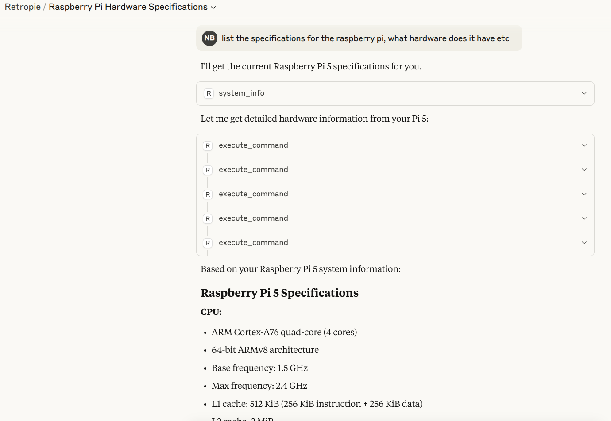
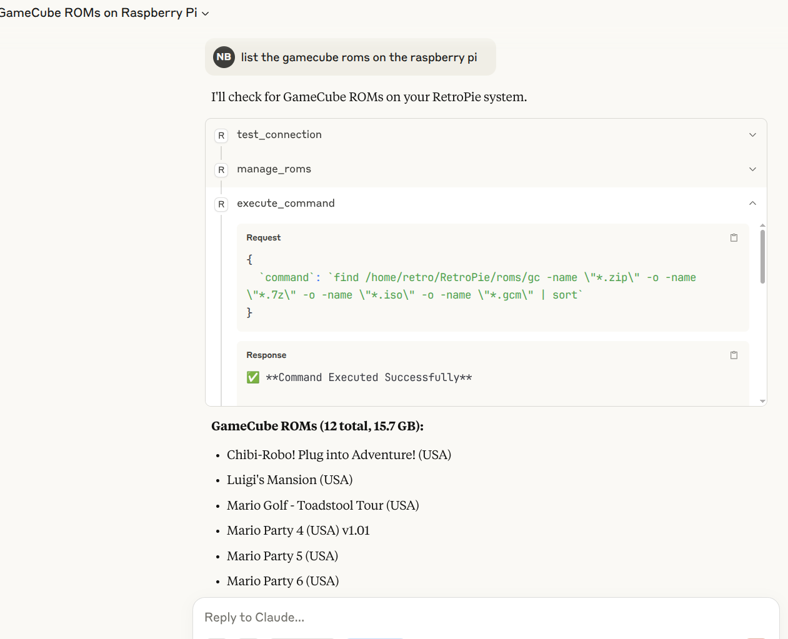
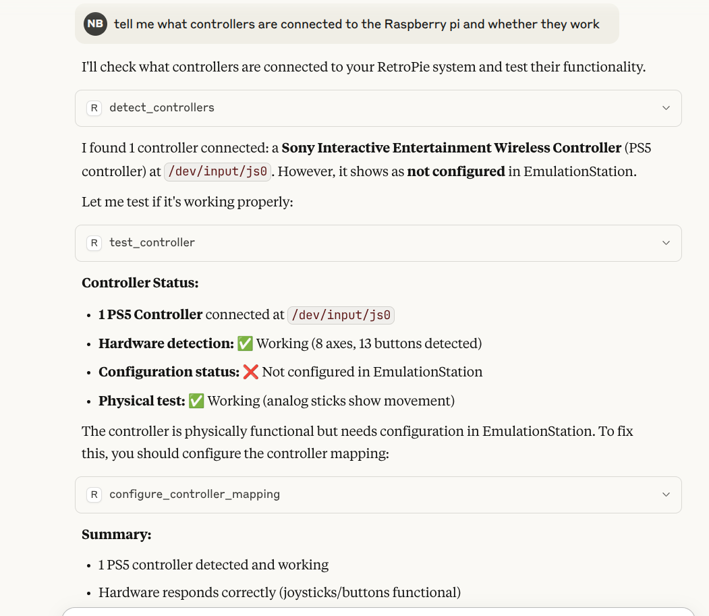

# RetroMCP

An MCP server that connects AI assistants to RetroPie systems for configuration and troubleshooting.

RetroMCP enables AI assistants like Claude to help configure and manage RetroPie installations on Raspberry Pi through secure SSH connections. Ask questions in natural language instead of learning Linux commands.

## Claude Talking to Your RetroPie Setup



*Claude analyzing your Raspberry Pi 5 hardware specifications and system information*



*Claude discovering and managing your GameCube ROM collection*



*Claude detecting PS5 controllers and providing configuration guidance*

## How It Works


**Simple Flow:** Natural Language ➜ AI Understanding ➜ Secure Commands ➜ RetroPie Configuration

**Examples:**
- "Set up my Xbox controller" - Installs drivers and configures button mappings
- "My N64 games are slow" - Checks performance and suggests tuning options
- "Find missing BIOS files" - Identifies required files for your emulators
- "Install arcade emulators" - Sets up MAME and configures input

## Project Status

**Current Phase**: Ready for use  
**Security Status**: Security validation implemented  
**Test Coverage**: 81% (434 tests passing)  

### Security Implementation

- **Command Injection Prevention** - All user inputs escaped with shlex.quote()
- **Path Traversal Protection** - System file and directory protection
- **SSH Security** - Host key verification and connection timeouts
- **Input Validation** - Parameter validation for all tools
- **Error Sanitization** - Removes sensitive data from error messages

### Security Notice

**RetroMCP requires sudo privileges** for system operations including package installation, service management, and file operations. This is necessary for RetroPie administration but has security implications:

- Use only on dedicated RetroPie/gaming systems
- Do not use on systems with sensitive data
- AI can install packages, restart services, and modify configurations
- Review commands before execution when possible

RetroPie systems are typically isolated gaming devices, making this privilege level appropriate for the use case.

## The Problem This Solves

**Retro gaming on Raspberry Pi is amazing but can be frustrating:**
- Setting up controllers often requires specific drivers and configuration files
- Different emulators need different BIOS files, but which ones?
- Performance tuning requires knowledge of arcane configuration files
- Troubleshooting usually means diving into Linux command line and forums
- Every setup is slightly different, making generic guides unhelpful

**Traditional solutions require you to:**
- SSH into your Pi and run complex commands
- Navigate unfamiliar Linux file systems
- Edit configuration files by hand
- Remember (or re-learn) which packages and settings work for your specific hardware

## The RetroMCP Solution

RetroMCP turns your AI assistant into a knowledgeable helper that:
- **Connects securely to your Pi** - Enterprise-grade SSH security with proper host verification
- **Learns your specific setup** - Remembers your username, paths, and successful configurations
- **Speaks your language** - Ask questions like "Why won't my Xbox controller work?" or "Help me get N64 games running smoothly"
- **Provides expert guidance** - The AI gets full context about your system and can troubleshoot effectively
- **Adapts automatically** - Works with standard setups and custom configurations alike

## What is RetroPie?

[RetroPie](https://retropie.org.uk/) is a popular retro gaming platform that turns your Raspberry Pi into a retro-gaming machine. It provides a user-friendly interface to run game emulators for classic consoles like NES, SNES, PlayStation, N64, and dozens more.

## What is MCP?

The [Model Context Protocol](https://modelcontextprotocol.io/) is an open protocol that enables AI assistants like Claude to interact with external systems through standardized server implementations. MCP servers expose tools and resources that AI models can use to perform actions on behalf of users.

## Key Features

### **Dynamic System Discovery**
- Automatically detects username (pi/retro/custom)
- Discovers RetroPie installation paths
- Identifies EmulationStation process type (systemd vs user)
- No hardcoded assumptions about your setup

### **Persistent System Profiles**
- Learns your specific configuration over time
- Remembers successful tool executions and solutions
- Tracks controller and emulator configurations
- Stores profile in `~/.retromcp/system-profile.json`

### **AI Context Sharing**
- Exposes system profile via MCP Resources
- Claude gets context about your specific setup
- Enables more effective troubleshooting conversations
- Remembers past issues and resolutions

### **Security Features**
- **SSH Security** - Proper host key verification and connection timeouts
- **Command Injection Prevention** - All user inputs properly escaped and validated
- **Input Validation** - Comprehensive validation for all parameters
- **Error Sanitization** - Prevents information leakage through error messages

## Architecture

RetroMCP follows hexagonal architecture principles:

- **Domain Layer**: Core business models and interfaces (ports)
- **Application Layer**: Use cases that orchestrate business logic  
- **Infrastructure Layer**: SSH implementations of domain interfaces
- **Discovery Layer**: Automatic system path and configuration detection
- **Profile Layer**: Persistent learning and context management
- **MCP Adapter**: Exposes functionality through the Model Context Protocol
- **Security Layer**: Input validation and command injection prevention

## Requirements

- Python 3.8 or higher
- SSH access to a Raspberry Pi running RetroPie
- Node.js (optional, for MCP Inspector testing)

## Installation

### 1. Enable SSH on RetroPie

On your Raspberry Pi:
1. Press F4 to exit EmulationStation
2. Run: `sudo raspi-config`
3. Go to "Interface Options" → "SSH" → Enable
4. Note your Pi's IP address: `hostname -I`

### 2. Configure Passwordless Sudo (Required)

**WARNING: This allows any user with SSH access to run any command as root without a password. Only do this on dedicated gaming systems.**

RetroMCP requires passwordless sudo for package installation, service management, and system configuration. On your RetroPie system:

```bash
# Edit sudoers file
sudo visudo

# Add this line at the end (replace 'pi' with your username):
pi ALL=(ALL) NOPASSWD:ALL

# Or for the retro user:
retro ALL=(ALL) NOPASSWD:ALL

# Save and exit (Ctrl+X, then Y, then Enter in nano)
```

**Security implications:**
- Any compromise of your SSH connection grants full root access
- Use only on isolated gaming systems
- Consider using SSH keys instead of passwords
- Do not use on systems with sensitive data

### 3. Install RetroMCP

```bash
# Clone repository
git clone <repository-url>
cd retroMCP

# Create virtual environment
python -m venv venv
source venv/bin/activate  # On Windows: venv\Scripts\activate

# Install dependencies
pip install -e .
```

### 4. Configure Connection

```bash
# Copy example configuration
cp .env.example .env

# Edit with your Pi's details
nano .env
```

Required settings in `.env`:
```
RETROPIE_HOST=192.168.1.100  # Your Pi's IP address
RETROPIE_USERNAME=retro       # SSH username (auto-detected after first connection)
RETROPIE_PASSWORD=password    # SSH password
# OR
RETROPIE_SSH_KEY_PATH=~/.ssh/id_rsa  # Path to SSH key
```

**Note**: RetroMCP automatically discovers your system configuration on first connection, including custom usernames, RetroPie paths, and EmulationStation setup. The system adapts to your specific configuration without requiring manual path configuration.

## Available Tools

### System Tools
- **test_connection** - Test SSH connection to RetroPie
- **system_info** - Get system information (CPU, memory, disk, temperature)
- **install_packages** - Install system packages via apt
- **update_system** - Update system packages
- **check_bios** - Check for required BIOS files

### Controller Tools
- **detect_controllers** - Detect connected game controllers
- **setup_controller** - Install drivers and configure controller
- **test_controller** - Test controller functionality
- **configure_controller_mapping** - Configure button mappings

### RetroPie Tools
- **run_retropie_setup** - Launch RetroPie-Setup
- **install_emulator** - Install emulators
- **manage_roms** - Browse and manage ROM files
- **configure_overclock** - Adjust performance settings
- **configure_audio** - Configure audio settings

### Management Tools
- **manage_services** - Control systemd services (start/stop/restart/enable/disable/status)
- **manage_packages** - Install/remove/update system packages via apt
- **manage_files** - File operations (list/create/delete/copy/move/permissions/backup)

### Admin Tools
- **execute_command** - Direct command execution with security validation
- **write_file** - File writing with path traversal and system file protection

### EmulationStation Tools
- **restart_emulationstation** - Restart EmulationStation
- **configure_themes** - Manage themes
- **manage_gamelists** - Manage game lists
- **configure_es_settings** - Configure EmulationStation settings

### Hardware Tools
- **check_temperatures** - Monitor CPU/GPU temperatures and thermal throttling
- **monitor_fan_control** - Check fan operation and cooling system
- **check_power_supply** - Monitor power health and under-voltage warnings
- **inspect_hardware_errors** - Analyze system logs for hardware issues
- **check_gpio_status** - GPIO pin status and configuration

## Testing

### Test Coverage & Quality

RetroMCP test coverage:

- **Overall Coverage**: 81%
- **Total Tests**: 434 across all layers
- **Security Tests**: 40 tests for command injection prevention and SSH hardening
- **Integration Tests**: 30 end-to-end workflow tests
- **Contract Tests**: 34 architectural compliance tests

### Test Categories

**Unit Tests**: Domain logic, use cases, and repositories with mocking  
**Integration Tests**: End-to-end workflows, SSH error handling, and tool execution  
**Contract Tests**: Architecture compliance and MCP protocol adherence  
**Security Tests**: Command injection prevention, SSH hardening, input validation  

### MCP Inspector (Recommended)

```bash
# Run the test script
./scripts/test-inspector.sh

# Or manually with npx
npx @modelcontextprotocol/inspector python -m retromcp.server
```

In the Inspector:
1. Tools are listed on the left
2. Click a tool to see its parameters
3. Fill in parameters and click "Run"
4. View results in the response panel

### Quick Setup

```bash
./setup.sh
```

## Claude Desktop Integration

### Official Support
Claude Desktop officially supports macOS and Windows.

### Linux Support
For Linux users (including Fedora), community solutions are available:
- [Fedora-specific build](https://github.com/bsneed/claude-desktop-fedora) - Recommended for Fedora users
- [Universal Linux installer](https://github.com/AstroSteveo/claude-desktop-linux-installer) - Supports RHEL/Debian/Arch

### Configuration
Once Claude Desktop is installed, configure MCP support:

**Config file location:**
- Mac: `~/Library/Application Support/Claude/claude_desktop_config.json`
- Windows: `%APPDATA%\Claude\claude_desktop_config.json`
- Linux: `~/.config/Claude/claude_desktop_config.json`

**Configuration:**
```json
{
  "mcpServers": {
    "retromcp": {
      "command": "python",
      "args": ["-m", "retromcp.server"],
      "cwd": "/absolute/path/to/retroMCP"
    }
  }
}
```

Restart Claude Desktop to load the server.

## Development

### Project Structure

```
retromcp/
├── domain/           # Business models and interfaces
│   ├── models.py     # Domain entities
│   └── ports.py      # Interface definitions
├── application/      # Use cases and business logic
│   └── use_cases.py  # Application services
├── infrastructure/   # External system implementations
│   ├── ssh_*.py      # SSH-based repositories
│   └── ...
├── tools/           # MCP tool adapters
├── discovery.py     # System path and configuration discovery
├── profile.py       # Persistent system profile management
├── server.py        # MCP server entry point
├── container.py     # Dependency injection with auto-discovery
├── config.py        # Configuration objects with dynamic paths
└── secure_ssh_handler.py  # Security-hardened SSH operations
```

### Code Quality

The project uses strict linting and formatting with zero-tolerance standards:

```bash
# Run linting
ruff check

# Auto-fix issues
ruff check --fix

# Format code
ruff format
```

All code must pass linting with zero errors before committing.

### Development Standards

Following **CLAUDE.md** principles:
- **Test-Driven Development** - Write tests first, implementation second
- **Hexagonal Architecture** - Clear separation of concerns with dependency injection
- **Immutable Objects** - All configuration and domain objects are immutable
- **Zero Global State** - All dependencies injected through interfaces
- **Comprehensive Security** - Input validation and command injection prevention
- **Contract Testing** - Architecture compliance enforced through tests

### Adding New Features

1. **Write failing tests first** (Red phase of TDD)
2. Define domain models in `domain/models.py`
3. Create interface in `domain/ports.py`
4. Implement infrastructure in `infrastructure/`
5. Add use case in `application/use_cases.py`
6. Wire up dependencies in `container.py`
7. Expose via MCP tools in `tools/`
8. **Ensure all tests pass** (Green phase)
9. **Refactor while maintaining coverage** (Refactor phase)

## Security

RetroMCP security measures:

### SSH Security
- **Host Key Verification**: Replaces AutoAddPolicy with known_hosts verification
- **Connection Timeouts**: Prevents hanging connections
- **Credential Cleanup**: Clears passwords from memory after use
- **Key Permission Validation**: SSH keys have secure permissions (600/400)

### Command Injection Prevention
- **Input Escaping**: All user inputs escaped with `shlex.quote()`
- **Input Validation**: Validation for GPIO pins, packages, themes, paths
- **Path Traversal Prevention**: Blocks directory traversal attempts
- **Command Whitelisting**: Only validated operations are executed

### Error Handling
- **Information Sanitization**: Removes passwords, IP addresses, and sensitive paths from errors
- **Graceful Degradation**: Proper error recovery and user feedback
- **Security Logging**: Audit trail for security-relevant operations

### Testing
40 security tests validate:
- SSH connection security and host verification
- Command injection prevention across all tools
- Input validation for all parameters
- Error message sanitization
- Path traversal prevention
- Dangerous command blocking
- System file protection

## Troubleshooting

### Connection Issues
- Verify SSH is enabled on the Pi
- Check firewall settings
- Ensure credentials in `.env` are correct
- Test SSH manually: `ssh pi@<your-pi-ip>`

### Permission Issues
- RetroMCP requires passwordless sudo for system operations
- Ensure your user has NOPASSWD:ALL configured in sudoers
- Check RetroPie directory ownership if file operations fail

### MCP Inspector Issues
- Ensure Node.js is installed: `node --version`
- Update npm if needed: `npm install -g npm`
- Clear npm cache: `npm cache clean --force`

### Security Issues
- Verify known_hosts file exists: `~/.ssh/known_hosts`
- Check SSH key permissions: `chmod 600 ~/.ssh/id_rsa`
- Review error messages for security warnings

## License

MIT