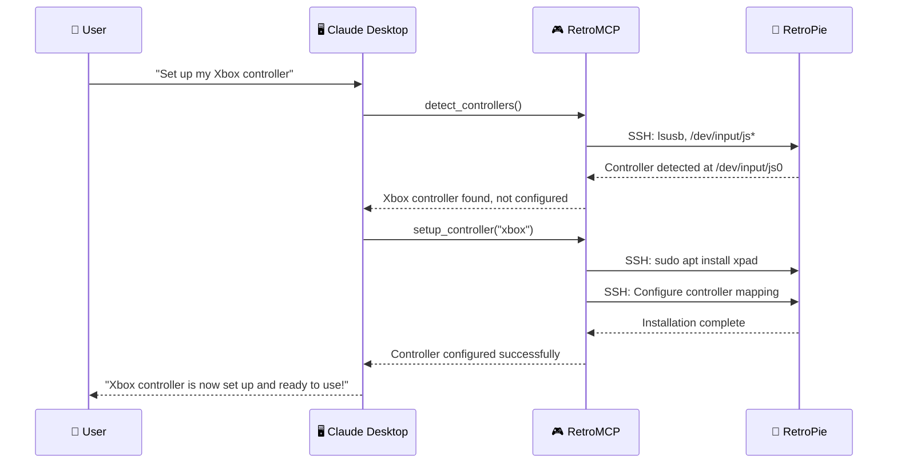
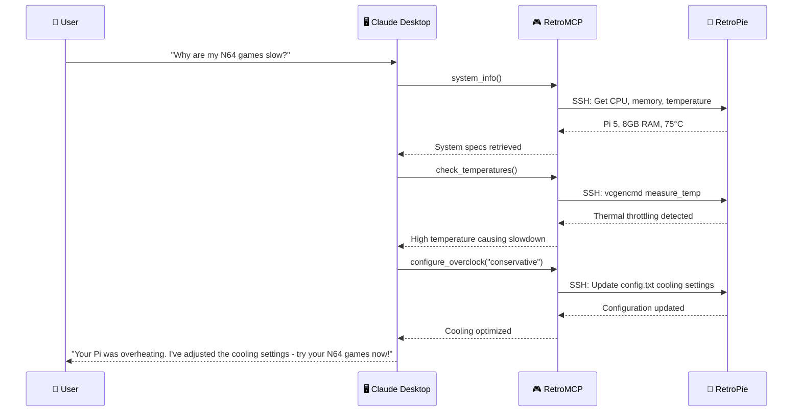
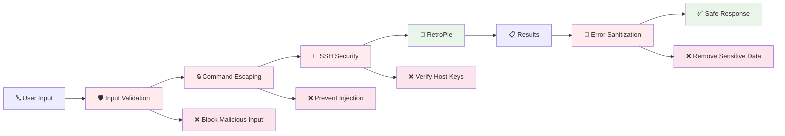

# RetroMCP System Architecture Flow

```mermaid
graph TD
    %% User Layer
    User[👤 User<br/>Natural Language Input]
    
    %% Claude Desktop Layer  
    Claude[🖥️ Claude Desktop<br/>AI Assistant]
    
    %% MCP Protocol Layer
    MCP[🔌 MCP Protocol<br/>JSON-RPC over stdio]
    
    %% RetroMCP Server Layers
    subgraph RetroMCP ["🎮 RetroMCP Server"]
        Tools[🛠️ MCP Tools<br/>controller_tools.py<br/>system_tools.py<br/>retropie_tools.py]
        
        subgraph AppLayer ["📋 Application Layer"]
            UseCases[🎯 Use Cases<br/>use_cases.py]
        end
        
        subgraph Security ["🛡️ Security Layer"]
            Validation[✅ Input Validation<br/>Parameter Validation]
            Escaping[🔒 Command Escaping<br/>shlex.quote()]
            SSHSec[🔐 SSH Security<br/>Host Key Verification]
        end
        
        subgraph Infrastructure ["🏗️ Infrastructure Layer"]
            SSHRepos[📡 SSH Repositories<br/>ssh_system_repository.py<br/>ssh_controller_repository.py]
            SSHClient[🔌 SSH Client<br/>ssh_retropie_client.py]
        end
        
        subgraph Discovery ["🔍 Discovery & Profile"]
            SystemDiscovery[🔍 System Discovery<br/>discovery.py]
            Profile[📊 System Profile<br/>profile.py]
        end
    end
    
    %% Target System
    subgraph PiSystem ["🍓 Raspberry Pi"]
        SSH[🔐 SSH Daemon<br/>Port 22]
        RetroPie[🎮 RetroPie<br/>EmulationStation<br/>Emulators<br/>ROMs]
        Hardware[⚙️ Hardware<br/>Controllers<br/>GPIO<br/>Audio/Video]
    end
    
    %% Flow connections
    User --> Claude
    Claude -.->|MCP JSON-RPC| MCP
    MCP --> Tools
    
    Tools --> Security
    Tools --> AppLayer
    Tools --> Discovery
    
    Security --> Validation
    Security --> Escaping  
    Security --> SSHSec
    
    AppLayer --> UseCases
    UseCases --> Infrastructure
    
    Infrastructure --> SSHRepos
    SSHRepos --> SSHClient
    
    Discovery --> SystemDiscovery
    Discovery --> Profile
    
    SSHClient -.->|SSH Commands| SSH
    SSH --> RetroPie
    SSH --> Hardware
    
    %% Response flow
    Hardware -.->|Results| SSH
    RetroPie -.->|Results| SSH  
    SSH -.->|SSH Response| SSHClient
    SSHClient -.->|Domain Objects| UseCases
    UseCases -.->|Structured Results| Tools
    Tools -.->|MCP Response| MCP
    MCP -.->|JSON-RPC| Claude
    Claude -.->|AI Response| User
    
    %% Styling
    classDef userStyle fill:#e1f5fe,stroke:#01579b,stroke-width:2px
    classDef claudeStyle fill:#f3e5f5,stroke:#4a148c,stroke-width:2px
    classDef mcpStyle fill:#e8f5e8,stroke:#1b5e20,stroke-width:2px
    classDef retroStyle fill:#fff3e0,stroke:#e65100,stroke-width:2px
    classDef piStyle fill:#ffebee,stroke:#b71c1c,stroke-width:2px
    
    class User userStyle
    class Claude claudeStyle  
    class MCP mcpStyle
    class Tools,UseCases,Validation,Escaping,SSHSec,SSHRepos,SSHClient,SystemDiscovery,Profile retroStyle
    class SSH,RetroPie,Hardware piStyle
```

## Data Flow Examples

### Example 1: "Set up my Xbox controller"


### Example 2: "Why are my N64 games slow?"


## Security Flow
